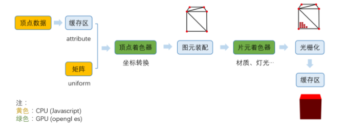
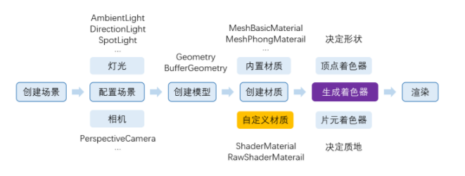

webGL 工作原理
1、获取顶点坐标
2、图元装配（即画出一个个三角形）（顶点着色器）
3、光栅化（生成片元，即一个个像素点）（片元着色器）
工作流程
1、准备数据阶段
在这个阶段，我们需要提供顶点坐标、索引（三角形绘制顺序）、uv（决定贴图坐标）、法线（决定光照效果），以及各种矩阵（比如投影矩阵）。
其中顶点数据存储在缓存区（因为数量巨大），以修饰符attribute传递给顶点着色器；
矩阵则以修饰符uniform传递给顶点着色器。
2、生成顶点着色器
根据我们需要，由Javascript定义一段顶点着色器（opengl es）程序的字符串，生成并且编译成一段着色器程序传递给GPU。
3、图元装配
GPU根据顶点数量，挨个执行顶点着色器程序，生成顶点最终的坐标，完成坐标转换。
4、生成片元着色器
模型是什么颜色，看起来是什么质地，光照效果，阴影（流程较复杂，需要先渲染到纹理，可以先不关注），都在这个阶段处理。
5、光栅化
能过片元着色器，我们确定好了每个片元的颜色，以及根据深度缓存区判断哪些片元被挡住了，不需要渲染，最终将片元信息存储到颜色缓存区，最终完成整个渲染。

THREE.js
工作流程
